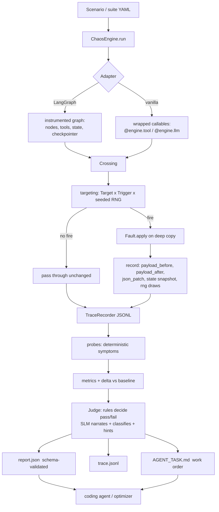

# 01 — Architecture

## 1. The one-paragraph model

A `ChaosEngine` owns a **fault plan** (faults + targets + triggers), a **seeded
RNG**, and a **trace recorder**. Adapters wrap the agent's interception points
(tool callables, LLM callables, LangGraph nodes and state) and route every crossing
through the engine. At each crossing the engine asks the plan "does anything fire
here?"; if so it snapshots state, applies the fault to a deep copy, records a
before/after diff, and lets execution continue. When the run ends, deterministic
**probes** read the trace and emit symptoms; a **judge** (rules, SLM, or both)
turns symptoms into a classified verdict, a narration, and a refinement hint; a
**reporter** writes `report.json`, `trace.jsonl` and, on failure, `AGENT_TASK.md`.

## 2. Module map

```
src/agent_loop_chaos/
├── __init__.py            public re-exports + __all__ (see docs/02-API.md)
├── version.py             __version__
├── errors.py              ChaosError, ConfigError, MissingExtraError, SchemaError, JudgeError, AdapterError
├── seeding.py             rng(seed, purpose) -> random.Random ; derive_id(seed, kind, n)
├── redact.py              redact(obj, extra_keys) -> obj ; DEFAULT_DENY patterns
├── jsonpatch.py           diff(before, after) -> list[Op]  (RFC 6902 subset: add/remove/replace)
├── context.py             RunContext, FaultContext, Crossing
├── targeting.py           Target, Trigger, matches(), should_fire()
├── mutations.py           pure payload mutators, MUTATIONS registry
├── faults/
│   ├── base.py            Fault ABC, FaultOutcome, FaultRecord, MutationLog,
│   │                      FAULT_REGISTRY, register_fault(), fault_from_dict()
│   ├── tool.py            tool-execution faults: corruption, error, latency,
│   │                      timeout, rate limit, argument tamper, LoopTrapFault
│   ├── llm.py             LLM/prompt and context faults
│   ├── state.py           graph-state and routing faults
│   ├── injection.py       PromptInjectionFault + payload corpus
│   ├── _messages.py       message-shape normalization shared by the llm faults
│   ├── injection_corpus.json
│   └── noise_corpus.json
├── trace.py               EventKind, Event, TraceRecorder, JsonlSink, MemorySink
├── probes.py              Probe ABC, PROBES, run_probes(trace) -> list[Symptom]
├── metrics.py             step/tool/llm/token/retry counters, baseline delta
├── judges/
│   ├── base.py            Judge protocol, Verdict, JudgeMeta
│   ├── rules.py           RuleJudge (deterministic, no model)
│   ├── slm.py             SLMJudge (OpenAI-compatible + Ollama transports)
│   ├── ensemble.py        EnsembleJudge (rules decide, SLM explains)
│   └── prompts/           judge_system.md, judge_user.md, narrator.md, refiner.md (packaged data)
├── report.py              ChaosResult + nested dataclasses, to_dict(), validate()
├── bundle.py              FindingsBundle writer: report.json, trace.jsonl, AGENT_TASK.md, baseline.diff, plan.json
├── scenarios.py           Scenario, ChaosSuite, matrix expansion, YAML/JSON loader
├── engine.py              ChaosEngine: register_fault, tool/llm decorators, run(), replay()
├── loop.py                RefinementLoop: baseline -> chaos -> probes -> judge -> bundle
├── adapters/
│   ├── base.py            Adapter protocol
│   ├── vanilla.py         plain-Python: decorators + wrap_callable + wrap_tools(dict)
│   └── langgraph.py       instrument_graph(), node wrapper, state faults, checkpoint hooks
├── cli.py                 alc run | replay | explain | list-faults | validate | judge | dashboard
├── dashboard/             (phase 10) stdlib-only live trace viewer — see docs/10-DASHBOARD.md
│   ├── server.py          ThreadingHTTPServer, routing, SSE hub
│   ├── watcher.py         run-dir discovery + byte-offset tailing of trace.jsonl
│   ├── api.py             read-only JSON endpoints, pure over the filesystem
│   ├── export.py          single-file HTML export (alc report --format html)
│   └── static/index.html  the whole UI, CSS and JS inlined, no external assets
└── schemas/               packaged copies of the JSON Schemas (importlib.resources)
```

## 3. Data flow



## 4. Core objects

### `RunContext`
Created once per run. Immutable except for counters.

```python
@dataclass
class RunContext:
    run_id: str                # derive_id(seed, "run", 0) — deterministic
    scenario_id: str | None
    seed: int
    started_at: str            # ISO-8601 UTC
    limits: Limits             # max_steps, timeout_s, max_tool_calls, max_tokens
    trace: TraceRecorder
    rng_registry: dict[str, random.Random]
    counters: Counters         # steps, tool_calls, llm_calls, retries, fires per fault
    baseline: BaselineRef | None
    tags: dict[str, str]
```

### `Crossing`
The single abstraction every interception point produces. This is what keeps tool,
LLM, node and state faults from needing four separate engines.

```python
Layer = Literal["tool", "llm", "state", "node", "edge", "checkpoint"]
Phase = Literal["pre", "post", "error"]

@dataclass
class Crossing:
    layer: Layer
    phase: Phase          # pre = before the real thing runs (args visible)
                          # post = after it returns (result visible)
                          # error = it raised (exception visible)
    name: str             # tool name, node name, llm alias, state key
    step: int             # engine step counter at this crossing
    call_index: int       # nth call of THIS name in this run (1-based)
    args: tuple
    kwargs: dict
    result: Any | None
    exception: BaseException | None
    state: Any | None     # graph state / user-supplied state snapshot
    span_id: str
    parent_span_id: str | None
```

A fault declares which `(layer, phase)` pairs it accepts; the engine refuses
registration otherwise with `ConfigError` at register time, not run time.

### `Fault`

```python
class Fault(ABC):
    kind: ClassVar[str]                     # stable name used in reports/YAML
    accepts: ClassVar[frozenset[tuple[Layer, Phase]]]
    severity_hint: ClassVar[Severity]       # default severity if it causes a failure

    def __init__(self, **params) -> None: ...           # validated eagerly
    def params(self) -> dict: ...                       # serialized into the report

    @abstractmethod
    def apply(self, crossing: Crossing, ctx: FaultContext) -> FaultOutcome: ...
```

```python
@dataclass
class FaultOutcome:
    action: Literal["replace_result", "replace_args", "raise", "delay",
                    "replace_state", "replace_messages", "noop"]
    value: Any = None                 # new result / args / exception / state / messages
    delay_ms: int = 0
    note: str | None = None           # human note, e.g. "dropped key temp_c"
    mutation: MutationLog | None = None
```

```python
@dataclass
class MutationLog:
    payload_before: Any
    payload_after: Any
    json_patch: list[dict]            # RFC 6902 subset; [] if not JSON-diffable
    unrepresentable: bool = False     # true when payload wasn't JSON-serializable
```

`FaultRecord` (what lands in the report) = fault identity + params + target +
trigger + fire stats + `MutationLog` + the RNG draws consumed.

### `Target` and `Trigger`

Targeting answers *where*; triggering answers *when* and *how often*. Keeping them
separate is what makes the scenario matrix expressible.

```python
@dataclass(frozen=True)
class Target:
    layer: Layer | None = None
    tool: str | None = None        # exact or fnmatch glob, e.g. "get_*"
    node: str | None = None        # LangGraph node name (glob)
    llm: str | None = None         # llm alias (glob)
    state_key: str | None = None   # dotted path, e.g. "user.location"
    phase: Phase | None = None
    predicate: Callable[[Crossing], bool] | None = None   # escape hatch, not serialized

@dataclass(frozen=True)
class Trigger:
    on_call: int | list[int] | None = None   # fire on the Nth call of the target (1-based)
    on_step: int | list[int] | None = None   # fire at engine step N
    after_step: int | None = None            # fire on every crossing after step N
    probability: float = 1.0                 # seeded; 1.0 = deterministic
    max_fires: int | None = 1                # None = unlimited
    cooldown_calls: int = 0                  # skip N crossings between fires
    stop_after_step: int | None = None
```

Resolution order at each crossing: layer/phase acceptance → `Target.matches` →
`Trigger.should_fire` (consuming seeded RNG only if `probability < 1.0`) → apply.
Every decision, including *not* firing, is traceable at
`trace_level="verbose"` as `fault_skipped` with a reason string.

### `TraceRecorder`

Append-only, monotonic `seq`, JSONL sink plus in-memory sink. Every event conforms
to `schemas/trace_event.schema.json`. Event kinds:

```
run_started            run_finished           internal_error
step_started           step_finished
tool_call_requested    tool_call_returned     tool_call_failed
llm_request            llm_response
node_entered           node_exited            edge_taken
state_snapshot         state_mutated
checkpoint_written     checkpoint_restored
fault_armed            fault_fired            fault_skipped   mutation_applied
probe_fired            metric
judge_request          judge_response         judge_verdict
assertion_result       log
```

Three trace levels: `minimal` (faults, errors, verdict), `standard` (default: all
calls + payload hashes + truncated payloads), `verbose` (full payloads, skipped
faults, state snapshots at every node). Payload truncation is explicit:
`{"__truncated__": true, "bytes": 91234, "sha256": "…", "head": "…"}`.

### Probes

Deterministic detectors that read the finished trace and emit `Symptom` objects.
Together with the **assertions** layer they are the pass/fail authority:
`docs/11-OUTCOMES-AND-ASSERTIONS.md` is normative for both, and defines the
`HarnessFacts` attribution rules that stop a probe firing on the harness's own
injection. Each probe is a pure function over `(trace, ctx)` — no model, no
network, and no clock.

```python
@dataclass(frozen=True)
class Symptom:
    code: str            # e.g. "no_output_validation"
    severity: Severity
    evidence: list[dict] # trace event refs: {"seq": 41, "kind": "tool_call_returned"}
    detail: str
```

Twenty probes ship in v0.1. The **normative list, with the exact detection rule for
each, is the table in `docs/07-TESTING.md` §3** — that table is the single source of
truth for probe codes; do not add a probe anywhere else. In outline they cover:
crashes and empty answers (`unhandled_exception`, `empty_final_answer`), loops and
progress (`loop_repeat_cycle`, `max_steps_exhausted`, `progress_stalled`),
retry behaviour (`no_retry_on_transient`, `retry_storm`), data handling
(`no_output_validation`, `fabricated_value`, `schema_violation`,
`truncated_output_used`, `pre_existing_invalid_args`), objective integrity
(`goal_token_loss`, `instruction_precedence_violation`), adversarial outcomes
(`injection_followed`, `secret_in_output`), state and side effects
(`state_key_lost`, `duplicate_side_effect`), and budgets
(`latency_budget_exceeded`, `token_blowup`).

### Judge

```python
class Judge(Protocol):
    def judge(self, ev: JudgeEvidence) -> Verdict: ...
```

`JudgeEvidence` is a compact, redacted projection of the run — never the raw trace,
so it fits a 3B model's context: injected faults with their diffs, the symptom
list, metrics, baseline delta, the final answer, the last two LLM exchanges, and
the top stack frames. Full design in `docs/05-JUDGE-AND-LOOP.md`.

### Reporter / bundle

One directory per run:

```
.chaos/<scenario_id>/<run_id>/
├── report.json        schema-validated ChaosResult
├── trace.jsonl        every event
├── plan.json          faults + seed + entrypoint  → replay input
├── baseline.diff      unified diff of baseline vs chaos final answer
├── AGENT_TASK.md      work order for a coding agent (failures only)
└── judge.json         raw judge request/response for auditability
```

## 5. Run lifecycle

```
ChaosEngine.run(target, inputs, ...)
 1. freeze plan            → plan.json, plan_hash = sha256(canonical json)
 2. open run dir + trace   → run_started (the dir is created NOW, and the sink
                             flushes per event, so a reader can follow live: D / docs/10 §2)
 3. resolve adapter        → vanilla | langgraph (explicit or sniffed)
 4. instrument             → wrap tools, llm, nodes, state
 5. execute under limits   → max_steps / timeout_s / max_tool_calls guards,
                             each crossing routed through the plan
 6. capture terminal state → final output OR exception (+ frames)
 7. close trace            → run_finished
 8. compute metrics        → counters + delta vs baseline  (BEFORE probes: D-11)
 9. evaluate assertions    → scenario `expect` + auto-synthesized (docs/11 §4)
10. run probes             → symptoms, over (trace, ctx) incl. HarnessFacts
11. classify + judge       → observed_behavior, success, failure_mode (docs/11 §§6–8),
                             then Verdict (rules decide, SLM explains)
12. assemble ChaosResult   → validate against schema (raise SchemaError in strict mode,
                             else record schema_errors[] and continue)
13. write bundle           → report.json, AGENT_TASK.md, judge.json, baseline.diff
14. return ChaosResult
```

Steps 8–13 must work on a trace loaded from disk, so `alc judge <run_dir>` and
`alc report <run_dir>` can re-judge an old run with a better model without re-running
the agent. Keep the post-run pipeline pure over `(trace, plan)`.

## 6. Limits and safety rails

- `max_steps` (default 25), `max_tool_calls` (default 50), `timeout_s`
  (default 120), `max_tokens` (optional). Exceeding one aborts the run with
  `LimitExceeded`, which is a **recorded outcome**, not an engine error — several
  failure modes (`infinite_loop`, `retry_storm`) are only detectable this way.
- Latency faults respect `max_injected_delay_ms` (default 2000) so a suite cannot
  wall-clock-stall CI.
- `dry_run=True` runs the whole pipeline with faults armed but never applied; used
  to prove the harness itself doesn't change agent behaviour. A suite should assert
  the dry run passes.

## 7. Extension points

| To add | Implement | Register via |
|---|---|---|
| a fault | `Fault` subclass with `kind`, `accepts`, `apply` | `@register_fault` decorator into `FAULT_REGISTRY` |
| a mutation | pure fn `(value, rng, **params) -> value` | `MUTATIONS["name"]` |
| a probe | `Probe` subclass with `code`, `detect(trace, ctx)` | `PROBES` list |
| a judge | `Judge` protocol | `--judge` entry point / `judges` mapping |
| a framework | `Adapter` protocol: `instrument()`, `run()`, `state_of()` | `adapters/<name>.py` |

Third-party packages can extend via the `agent_loop_chaos.faults`,
`agent_loop_chaos.probes`, and `agent_loop_chaos.judges` entry-point groups. Load
them lazily and never let a broken plugin break a run: log and skip.

## 8. Threading, async, and reentrancy

- The engine keeps per-run state in a `contextvars.ContextVar`, so nested and
  concurrent runs in one process do not share counters.
- Wrappers preserve `functools.wraps` metadata, signatures
  (`inspect.signature` passthrough), and coroutine-ness.
- LangGraph parallel branches produce interleaved crossings; `span_id` /
  `parent_span_id` make the trace reconstructable. `seq` is globally monotonic per
  run via a lock.
- RNG per purpose (`rng(seed, "trigger:f1")`) so adding a fault does not shift the
  random stream of unrelated faults. This is what keeps seeded runs stable as a
  suite grows.
